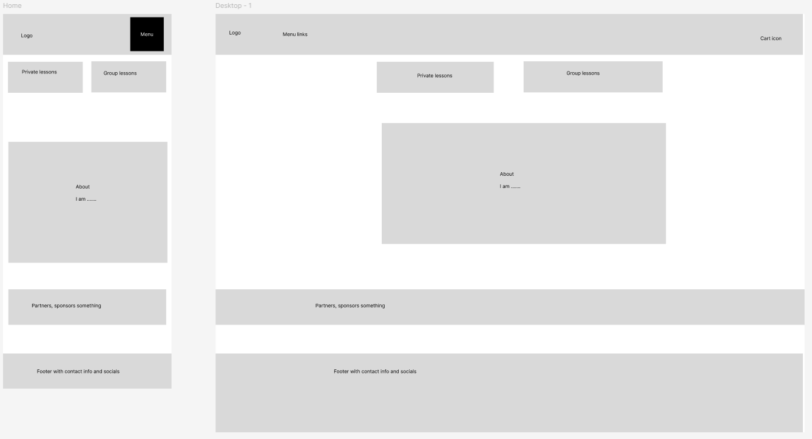
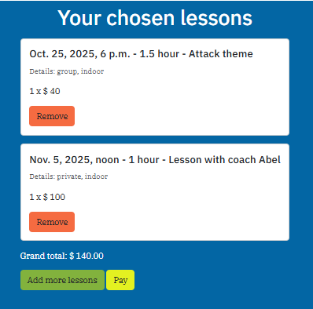

# court_love

[Live link to website](https://court-love-8302d0b2e53d.herokuapp.com/)

Court Love offers individual tennis lessons, easy to book only when you have the time!

Generated by [Am I Responsive](https://ui.dev/amiresponsive).

## Planning

### Site goals

The website aims to offer users:
- a way to book individual tennis lessons online.
- a way to keep a personal profile with a self-rated level.

Inspired by [Matchi](https://www.matchi.se/) and [Grands](https://playgrands.com/se).

### User stories

See [project board](https://github.com/users/LizzyonGit/projects/6/views/1) for the agile methodology followed during this project and the end result. Implemented features in the **Done** column, future features and unfixed bugs in the **Won't do** column.

#### As a site admin, I can:
**Website layout milestone**
- display contact info so that I can be contacted by users.
- offer a clear landing page so that I can persuade users to book a lesson.

**Product management**
- add lessons to the website so that I can get bookings for them.
- edit lessons so that I can update details if there are any changes.
- delete a lesson so that I can prevent booking of a lesson if it is not offered anymore.

**Book lesson milestone**
- receive payments so that I get rewarded for my services.
- prevent bookings on full lessons so that I do not get overbooked lessons leading to refunds.

#### As a site user, I can:
**Website layout milestone**
- arrive at a clear landing page so that I can know what the website is about.
- get back to the top of the page with one click when there are a lot of lessons, so that I can easily get back to the menu.

**Product information milestone**
- find neccessary information about lessons so that I can book lessons that suit my needs.
- narrow down the list of lessons to specific characteristics so that I can easily view lessons that match my needs.
- see how many have booked lesson so that I can see how many will be joining.

**Book lesson milestone**
- add lessons to my cart so that I can proceed to payment.
- see an overview of my cart so that I can see which lessons I am about to buy.
- remove lessons from the cart so that I can manage what I am about to buy.
- navigate to a checkout page so that I can pay for my lessons.
- complete a payment so that I am allowed to attend the lesson.
- see a confirmation after payment so that I know that my payment has been successfull.
- get an email after purchase so that I can review my purchase any time and see when I should go to the lesson, without the need to log in.

**Authentication milestone**
- register so that I can log in to the website.
- log in so that I can see my order history and personal details.
- log out so that I can control whether I want to be logged in or not.

**User profile milestone**
- see my order history so that I can check what lessons I have booked.
- manage my self-rated level so that I can update it along my tennis lesson journey.
- manage a profile image so that I can personalise my profile page.

### Design
#### Database
Below is my initial database schema. I used [Lucidchart](https://lucid.app/lucidchart/2079b9e7-4f65-4200-8337-c7328cfd5e1e/edit?invitationId=inv_4a4f8b69-07b0-4019-82a4-0720dfb4bfd0&page=mkFtcNkq6Rib#) to create it.

- I made some changes to the Product model, which is the Lesson model. I added **Places left** to handle the lesson having a max amount of people that can book it. I first thought I could do this with only the **Capacity** field.
- The lesson image is not an ImagField, but a CharField with choices, where each choice sets a specific image stored in the project.
- I converted some fields to models, because I wanted the site admin to be able to preset these fields, and add to them. This applies to the fields **Place**, **Level interval**, **Duration**, and **Capacity**. I also added a BooleanField **Deleted**, to handle deletion of lessons that have been booked before.

- To the UserProfile model, I added a CloudinaryField, so users can upload a profile image.

- The OrderLineItem model does not have Category and Level, but I added UserProfile. This is so that in admin, coaches can see who is attending by checking the order lines with their lesson, without the need to check per order, and see the attendees' level.

#### Wireframes

Below are my initial wireframes for mobile and laptop screen sizes. I used [Figma](https://www.figma.com/) to create them.

    
Home page
Initially, I had planned some sponsor logos but instead I opted for more text on the home page on how everything works. The About section is there, and I added more images to make it more appealing. The logo moved to the center for mobile screens, and the cart icon is now to the right, like the desktop wireframe.

  

    
All lessons page
Initially, I wanted to stack all lesson cards on all screen sizes, but my mentor advised me to fill the screen more. So I now have up to three columns of lesson cards. I could not implement the calendar. I also added four buttons with all category/place combinations, instead of two, and an introductory text with the addresses.

  

    
Cart
The cart looks mainly the same as the wireframe, as the lesson cards have less information and the image is removed, they are smaller and they are added in one column on all screens. The buttons' placement has changed slightly. I have implemented a button to go back to all lessons also when there are lessons in the cart late in the process, after feedback. I had it in my wireframe but did not think it was needed because the page is easily accessible in the menu.

  

    
Checkout/checkout success
The checkout is inspired by Boutique Ado, and the next page after a successful payment (checkout_success.html), was intended to look like this, just without the payment form (left part on desktop screens). In the end, the checkout success page looks more like the cart page, as the left part does take too much place for just an intro text, so it's also one column on desktop screens.

  

    
Profile
The profile is inspired by Boutique Ado with a form and the order history in separate colums, stacked on mobile screens. After feedback from my mentor, I added the possibility to add a profile image, which is not in the wireframes. Also, name and email are not in the form.

  

    
Add/edit lesson
The page to add a lesson to the website is simply a form in one column on all screen sizes. I added a button to cancel, and the buttons are left aligned instead of right aligned. The page to edit a lesson is the same.

  

    
Log in/Log out/Register
The pages to register and log in simply consist of a form and a button to submit, the page to log out simply of a confirmation question and a button to log out.

  

#### Colour schemes
I used colours related to tennis with a shade of blue, red and green to reflect the different surfaces hard court, clay and grass. Yellow is derived from the tennis ball colour, white is the line colour, and black is used as a contrast colour.

This is my palette: https://coolors.co/0366A4-ffffff-F56B41-82b23d-000000-e3f121

#### Fonts
I used a font recommended with my logo from Canva from Daily Creative (https://www.canva.com/design/DAGr7kiK5zA/dRQFAGHjN97D28Y8rcLtyg/edit?ui=eyJHIjp7IkQiOnsiRCI6eyJBPyI6IkYifX19fQ): IBM Plex Sans. In google fonts, it was recommended to pair it with IBM Plex Serif (https://fonts.google.com/specimen/IBM+Plex+Serif/about?preview.text=Court%20Love&query=IBM+Plex)

#### Logos and images
I created the logo from a template in Canva. 

All images are free from [pixabay](https://pixabay.com/).

#### Content
All content is written by me.

## Features 

### Existing features

- __Navbar__

    - The navbar holds the logo, menu links depending on the login state of the user, the cart icon (tennis rackquet) and current cost for all lessons in the cart. The logo is in the upper left corner in the expanded navbar, in the compressed navbar it is in the center.

    Navbar logged in user:

    

    
    Navbar logged out user:

    

    
    Compressed navbar:

    

    
    Project file: templates/base.html

- __Home page__

    - Buttons **Private lessons** and **Group lesson** to go to all private or group lessons.
    - **About Court Love** section with image carousel.
    - **How does it work** and **Register** sections and single image.
    - Stacked on small screens, up to two columns on larger screens.

    

    Project file: home/templates/home/index.html

- __Footer__
    - **Contact** section with cancellation info, phone and email, social media links.
    - **Places we teach at** with outdoor and indoor adresses.
    - Stacked on small screens, up to two columns on larger screens.

    

    Project file: templates/base.html

- __All lessons page__
    - Buttons **Group - indoor**, **Group - outdoor**, **Private - indoor** and **Private - outdoor** to filter the list of lessons. Two rows with two buttons on small screens, one row with four buttons on large screens.
    - Adjusted title **All lessons** or based on which button was clicked: **All group lessons - indoor**, **All group lessons - outdoor**, **All private lessons - indoor**, or **All private lessons - outdoor**.
    - Again the adresses for indoor and outdoor, as I did not want to have that in the lesson cards, and maybe users don't read the footer. Both addresses show when you click **All lessons**, only one shows when one of the buttons for outdoor or indoor were clicked.
    - A list of lesson cards, stacked on small screens and up to three columns on large screens.
    __Lesson card__
    - Image, if selected by site admin. Images can have different sizes but it is advised to use vertical images. An image is not required as it does not add much value to the content, it just looks nicer. Therefore, there is a minimal selection of images that can be added to a card, and they can be the same for several cards. Like the real life website Matchi.com, coaches can have their image, or it can just an image of someone on a court. For now, there are the following images:
      - An image of Marina, Bernardo and Abel, the coaches
      - An image of people serving, for lessons that focus on serving
      - An image of someone hitting a colley, for lessons that focus on an attacking play style
      - An image with tennis balls, that can be used for any kind of lesson
    - Date and time, duration, name as heading
    - Description: descriptions can differ in length and cause some distortions between 576 and 768 px screen width when the lesson cards are displayed in rows of two with the image in the top part. The cards are set to be the same height so the card footers are always aligned, but larger descriptions can make images smaller. It is therefore advised to use roughly the same description length. On screens smaller than 576 px the cards are stacked in one column so this is not an issue, and on screens larger that 767 px, the image is places to the left of the card, so it is not an issue.
    - Place: outdoor or indoor
    - Level
    - Capacity: how many people can join
    - Places left: how many places are left to book
    - Price
    - **Add to cart** button, or when there are no places left, **Not bookable** disabled button.
    - For site admin only: **Edit** and **Delete** buttons. Intentionally this section is not styled like the rest of the card, to highlight it is part of the admin.

    All lessons:

    

    Private - indoor filtered:

    

    Project file: lessons/templates/lessons/lessons.html

- __Cart__
  - Overview of lesson cards showing only the date, time, duration, name, category, place, and price
  - Always stacked in one column
  - **Remove** button on each lesson card to remove the lesson form the cart
  - Grand total
  - Button **Add more lessons** to go to **All lessons** page
  - Button **Pay** to go to checkout
  - If no lessons are in the cart: appropriate text and button to go to **All lessons**
    

    

    Project file: cart/templates/cart/cart.html

- __Checkout__
    - Details & payment
      - **Personal details** form
      - Option to save phone number if logged in, otherwise links to **Register** and **Log in** pages
      - **Payment details** with field to fill in card number and error message field (hidden if no error)
      - Buttons **Back to cart** and **Complete payment**
      - Note on how much will be charged
    - Order summary (number of lessons)
      - Lesson cards from the **Cart** page
      - Grand total
    - Stacked on small screens, up to two columns on larger screens.
    

    

    Project file: checkout/templates/checkout/checkout.html

- __Order confirmation__
    - **Payment succesful** page
      - After completing the payment, the user is will see this page.
      - From **My profile**, the user also can go to **Payment successful** pages  from old orders.
      - It has an introductory text with the order number, which you should hover over to see the whole number. This is because on small screens, this large number messes up the responiveness.
      - The booked lesson cards display the same as in the **Cart** page, and are stacked on all screen sizes. 
      - The grand total
      - If the user had come from the profile, there is a **Back to profile** button.
      

      

      Project file: checkout/templates/checkout/checkout_success.html

    - Order confirmation email
      - After a successful payment, the user will receive the order confirmation email.
      

      

      Project files: checkout/templates/checkout/confirmation_emails/confirmation_email_body.txt and confirmation_email_subject.txt

- __My profile__
    - Default personal information
      - Link to [NTRP](https://activenetwork.my.salesforce-sites.com/usta/articles/en_US/Article/League-NTRP-Rating-Information) to assess your own level
      - **Phone number** field where you fil in a phonenumber
      - **Level** select field where you can select a level (1.5-7) according to the NTRP
      - If the user has added an image:
        - Text *Current profile image:* 
        - The current image that the user has added 
        - Checkbox **Remove current profile image after Update**, when you select this and click **Update** the image will be deleted from the profile
        - Text *Select an image and click Update below*
      - If the user has not added an image:
        - Text *You have not added a profile image*

      - **Select image** button
      - If an image is selected, a text appears *Click Update to set image to: (name of file)*. There is no preview of the image that is selected.
      - **Update button** to update the default personal information.

      - Note that you can not add a new image and remove the old image at the same time. When you select to remove the current image, the **Select image** button and text *Select an image and click Update below* becomes hidden. When you first select a new image, the checkbox **Remove current profile image after Update** becomes hidden.
    

    - Booking history
      - If applicable, a list of previous orders with the order date and order number, linking to the original order confirmation. The order number is shortened because it hinders responsiveness on small screens, when you hover over it, it shows the whole number.
      - If no previous orders, a text *You have no previous bookings*.
  
    Stacked on small screens, up to two columns on large screens.

    Profile with no image: 
    
    

    Profile with image: 
    
    

    Booking history: 
    
    

    
    Project file: profiles/templates/profiles/profile.html

- __Register__
  - Link to **Log in** page for those who already have an account
  - **E-mail** field
  - **E-mail (again)** field
  - **Username** field
  - **Password** field
  - **Password (again)** field
  - **Register** button

  
  

  
  Project file: templates/allauth/account/signup.html

 

- __Log in__
  - Link to **Register** page for users who do not have an account yet
  - **Login** field where you can put your email address or username
  - **Password** field
  - **Remember Me** checkbox
  - **Forgot password?** link
  - **Log in** button

  
  

  Project file: templates/allauth/account/login.html

- __Log out__
  - Intro text and **Log out** button to confirm 

  
  

  
  Project file: templates/allauth/account/logout.html

- __Feedback messages__
  - Toast messages appear after the following actions:
    - Register/Log in/Log out
    - Add lesson to cart (with button to go to the cart)
    - Try to add same lesson to cart
    - Remove lesson from cart
    - Successful payment
    - Profile update

    - Delete lesson
    - Update lesson
    - Add lesson
    - Set **Places left** to higher value than **Capacity** on lesson
    - Set date to passed date on lesson

  - Errors like:
    - Lessons that are not available anymore are in the cart
    - Invalid forms
    - You write in a url that you are not authorised to access
    - Something went wrong with a payment

  The messages adapt their width to the content, but there is a max-width set. Here is an example of a message whn you add a lesson to your cart:

  

- __The 404 page__

  - Text *No match*, *Noting found here*
  - Button **Home** to go to the homepage.

    
    

    Project file: templates/404.html

#### Site admin only
- __Add lesson__
    - Form with the following fields:
      - **Category**: select **Group lesson** or **Private lesson** (can be added to in admin, but this would hinder the website's category buttons)
      - **Name**: write in the lesson name
      - **Description**: write in the description
      - **Price**: write in a price
      - **Date time**: select a date and time from the date and time picker
      - **Duration**: select a duration (durations can be added in admin)
      - **Capacity**: select total nr of people that can join (capacity values can be added in admin)
      - **Places left**: not required, write in a nr or leave blank to be set to same as **Capacity** after form submit
      - **Level interval**: select a level interval (level intervals can be added in admin)
      - **Place**: select **outdoor** or **indoor** (can be added to in admin, but this would hinder the website's category buttons)
      - **Image**: not required, select one of the options. Each option is connected to a specific image in the static/images folder. Not adjustable in admin.
    - **Cancel** button to reset the form
    - **Add lesson** button to add the lesson

    

    Project file: lessons/templates/lessons/add_lesson.html

- __Edit lesson__
  - Form with the same fields and functionality as **Add lesson**
  - **Cancel** button to cancel changes and go back to the **All lessons** page
  - **Update lesson** button to update the lesson and go back to the **All lessons** page

  
  

  Project file: lessons/templates/lessons/add_lesson.html

- __Delete lesson__
  - Modal that opens up when you click **Delete** on a lesson card on the **All lessons** page.
  - The text depends on whether or not the lesson has been booked before. This is useful for the admin to know if a user needs to be contacted about this and refunded, or if nothing needs to be done. 

  - You can click the cross, **Do not delete** or outside the modal to close the modal.
  - When you click **Delete lesson**, you delete the lesson.
  - When a lesson has been booked before, you can not delete it like this, you can only remove it form the frontend. Any order lines need to be deleted in admin before you can delete the lesson from the database. When a lesson has not been booked before, it can be deleted from the database when you click **Delete lesson** in the modal.

  Delete modal for lesson not booked before: 

  

  Delete modal for lesson booked before: 

  

### Features left to implement

- Possibility to select a date range to filter the lesson list.
- Email address field on My profile with possibility to change it and prepopulate checkout form with it.
- Link directly to lesson after editing/adding a lesson, and for the user, from the cart page.
- When site admin cancels an order in admin, lessons' **Places left** is increased automatically.

#### Future ideas
- Make profile visible for others attending a lesson, so you can see each other's level and profile image. Maybe even with chat groups automatically created so you can talk with the attendees before and after a lesson. This would of course need much more security both for the image which now is only visible for the user and in admin, but also for chat messages.
- Sell gift cards for tennis lessons.
- Users can add themselves to a wait list for fully booked lessons and get notified in case someone canceled.
- Users can choose to get notified by email when new lessons have been added.
- You can only book lessons according to your level.
- Reviews page for Court Love as a company.

## Testing

See [TESTING.md](TESTING.md).

## Technologies used

### Languages

- HTML
- CSS
- Python
- JavaScript

### Frameworks - libraries - programs used

- [Django](https://www.djangoproject.com/) version 5.2.4
  - Including *django-allauth*, *django-crispy-forms*.
  - With installed whitenoise and gunicorn.
- [Bootstrap](https://getbootstrap.com/) version 5.3
- [jQuery](https://jquery.com/) version 3.5.1
- [Stripe](https://stripe.com/) for payment solution
- [Lucidchart](https://lucid.co/) for database planning
- [Figma](https://www.figma.com/) for wireframes
- [VS Code](https://code.visualstudio.com/) as IDE
- [GitHub](https://github.com/) for version control
- [Heroku](https://www.heroku.com/) for hosting
- [Cloudinary](https://cloudinary.com/) for image hosting
- [Google Fonts](https://fonts.google.com/) for my font pair and tennis racquet cart icon
- [Canva](https://www.canva.com/) for creating the logo
- Windows Paint and Windows Photo for adjusting images
- [TinyPNG](https://tinypng.com/) for compressing image size and converting to .webp
- [RealFaviconGenerator](https://realfavicongenerator.net/) for creating favicon icons and the HTML code, and checking the favicon
- Chrome DevTools for verifying responsibility and troubleshooting code
- [Am I Responsive](https://ui.dev/amiresponsive) for an image displaying the website on different screens
- [Autoprefixer](https://autoprefixer.github.io/) for adding the necessary prefixes to my CSS stylesheet

## Deployment and development

### Deployment
The site was deployed to Heroku. The steps to deploy are:

1. Go to your Heroku dashboard and create a new app.
2. In the **Deploy** tab of your new app, under **Deployment method**, click **GitHub**. 
3. Under **Connect to GitHub**, in the field next to your username on Github, type the repository name (*LizzyonGit/rates_r_us*) of the project and click **Search**. 
4. The corresponding repository name appears below, click the **Connect** button.
5. In **Settings**, under **Config Vars**, add a value for keys *SECRET_KEY*, *DATABASE_URL* and *CLOUDINARY_URL*.
6. Scroll down to **Manual deploy**, select the main branch to deploy and click **Deploy Branch**.
7. At the top of the page, click **Open app** to open the site.

### Local development
To fork the repository:
  - In the GitHub repository, click the **Fork** button in the top right corner.

To clone the repository:
  1. In the GitHub repository, click the **Code** button.
  2. In the **Local** tab, select if you want to clone with HTTPS, SSH, or GitHub CLI, and copy the link below it.
  3. Open the terminal in your code editor and change the current working directory to the location you want to clone this repository to.
  4. Type *git clone* and paste the link from step 2, and press Enter.

Set up your IDE
  1. Set up a virtual environment.
  2. Install the packages from the requirements.txt file.
  3. Create variables for *SECRET_KEY*, *DATABASE_URL* and *CLOUDINARY_URL*.
  4. Apply migrations.
  5. Collect static files.
  6. Run the development server.

## Credits 

### Media

- Free images from [pixabay](https://pixabay.com/). Logo adapted from [Canva](https://www.canva.com/).

### Resources

__Planning__
- For a font pairing idea, [Google Fonts](https://fonts.google.com/) based on font used in logo from [Canva](https://www.canva.com/).

- For getting a colour scheme, [Coolors.co](https://coolors.co).

__During development and testing__
- Inspiration and code bits from CI walkthrough projects *I think therefore I blog* and *Boutique Ado*.
- [Bootstrap documentation](https://getbootstrap.com/docs/5.3/getting-started/introduction/).
- [Django documentation](https://docs.djangoproject.com/)
- [Stripe documentation](https://docs.stripe.com/)
- Forums for specific questions:
  - [Django forum](https://forum.djangoproject.com/)
  - [Stackoverflow](https://stackoverflow.com/)
  - [Reddit](https://www.reddit.com/)
  - CI Slack community.
- Informative sources for reading up on concepts:
  - [W3schools](https://www.w3schools.com/)
  - [MDN Web Docs](https://developer.mozilla.org/en-US/)
  - [Medium.com](https://medium.com/)
  - [LearnDjango](https://learndjango.com/)
  - [GeeksforGeeks](https://www.geeksforgeeks.org/)
  - [Information on bare except](https://jerrynsh.com/stop-using-exceptions-like-this-in-python/)

__Project finalisation__ 
- [Grammarly](https://www.grammarly.com/grammar-check) spellchecker.

### Acknowledgments
- My mentor Jubril for the feedback.
